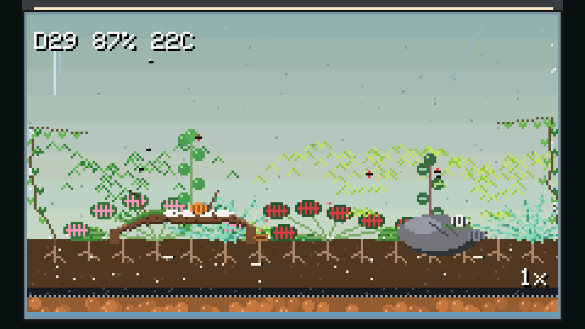
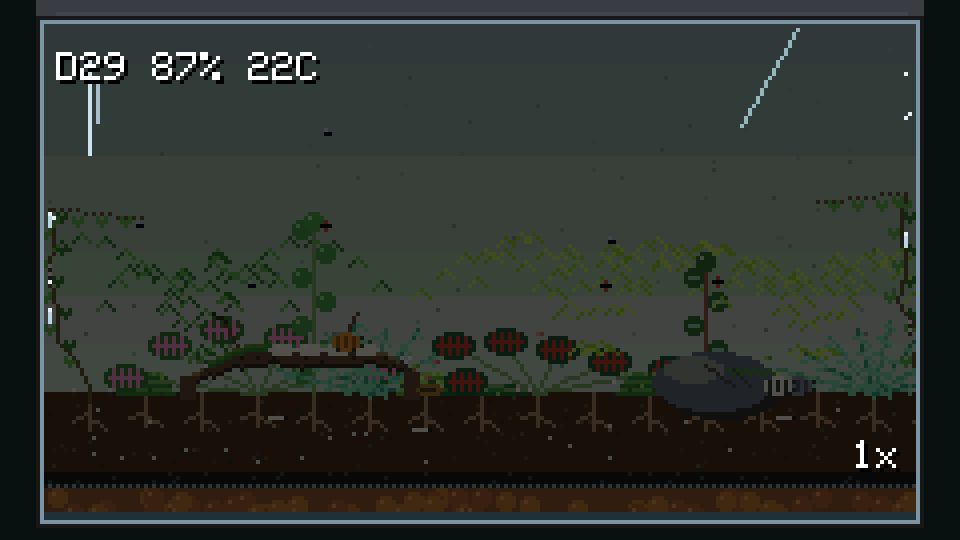
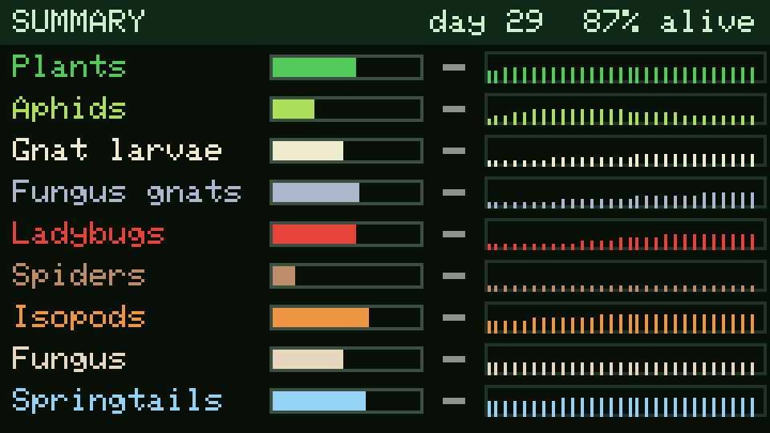
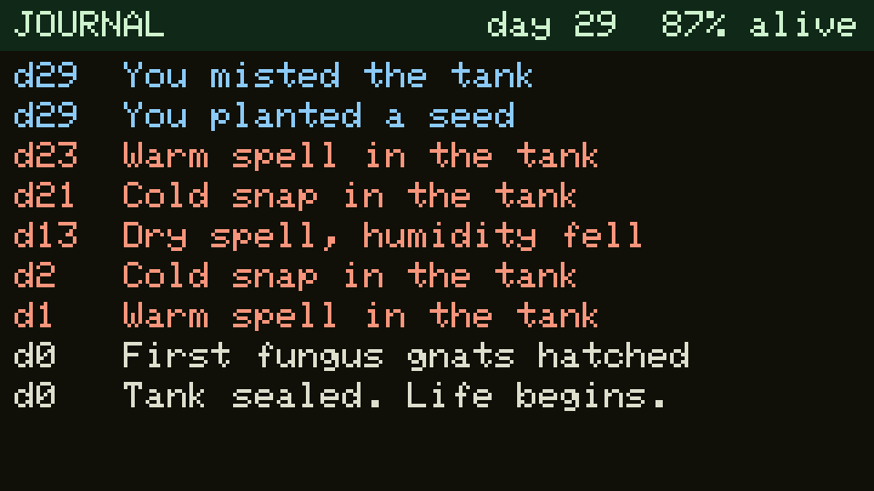
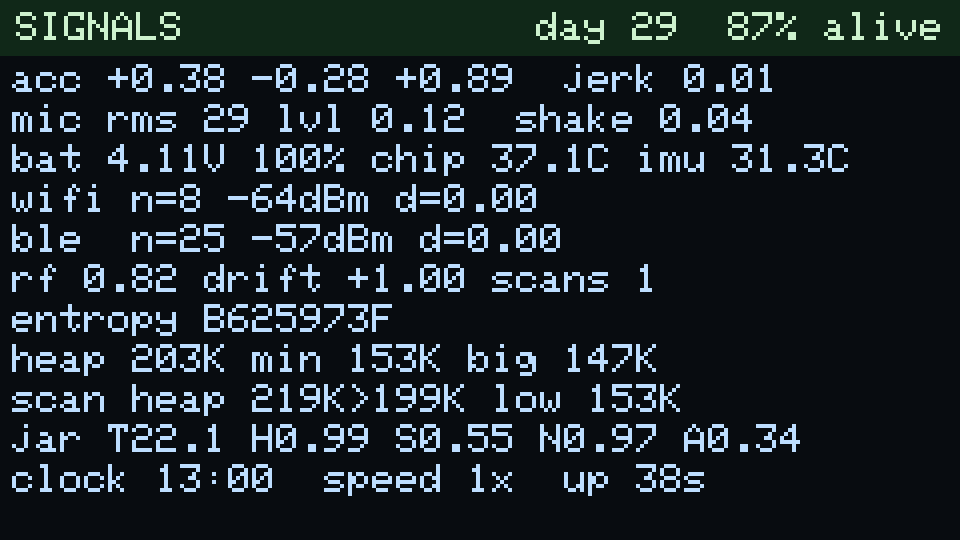
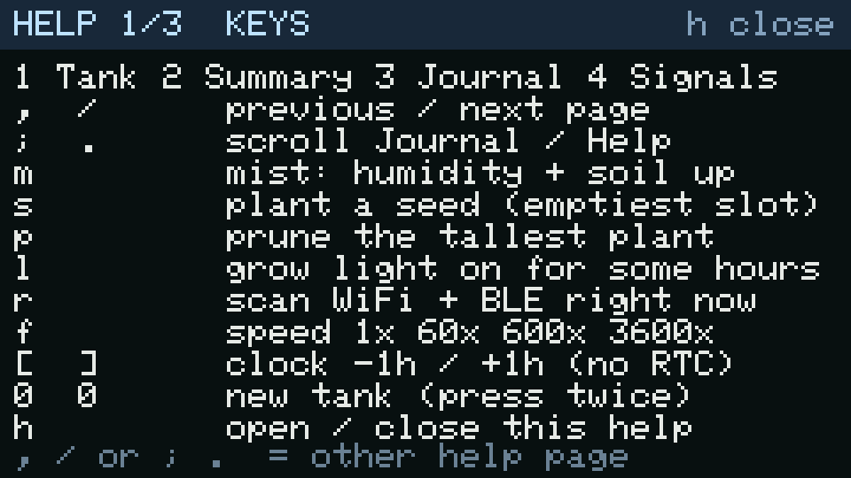
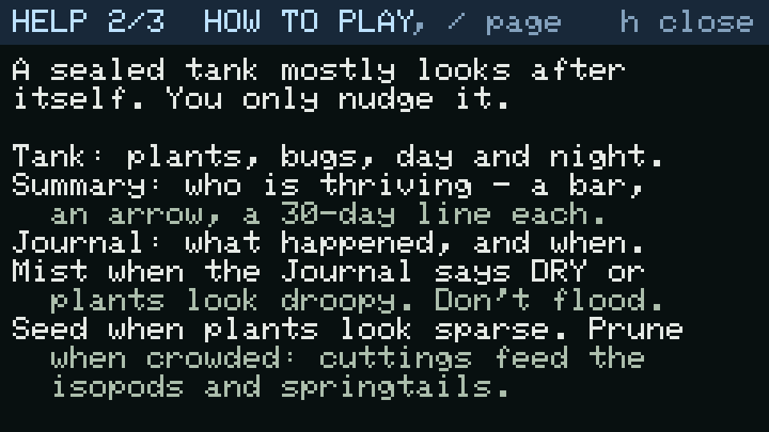
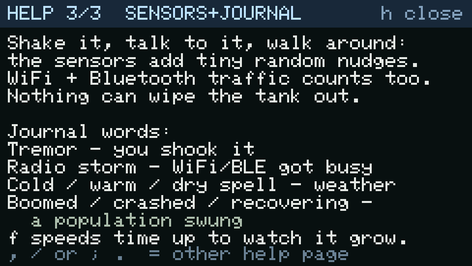

# Terrarium for the Cardputer ADV

A sealed glass terrarium that lives on an [M5Stack Cardputer ADV](https://docs.m5stack.com/en/core/Cardputer-Adv).
Moss, ferns, fittonia and creeping fig grow; springtails and isopods clean up; fungus gnats
and aphids cause trouble; a jumping spider and a ladybug keep them in check. It runs in
real time on the device, and the board's own sensors nudge it — gently.

| Day | Night |
|---|---|
|  |  |

| Summary | Journal | Signals |
|---|---|---|
|  |  |  |

## What you see

A fish-tank-sized terrarium viewed through the front glass: a grow-light bar on top, drainage
gravel, a mesh barrier, a charcoal layer, soil and leaf litter below, a mossy driftwood branch
and a stone. The grow light follows a day/night cycle and the whole tank dims when it is off.
Condensation forms on the glass when the air is humid.

**Plants** (each of 16 slots grows its own biomass; all are ordinary closed-terrarium plants):
cushion and carpet moss, button/lemon-button ferns, fittonia (pink and red veins), pilea,
peperomia, baby tears, selaginella, and creeping fig climbing the glass.

**Creatures:** springtails, isopods (grey, orange, dalmatian), fungus gnats and their larvae,
aphids, a ladybug, a jumping spider, plus mold and small mushrooms.

## Pages and keys

Every key is a single press.

| Key | Action |
|---|---|
| `1` `2` `3` `4` | Tank / Summary / Journal / Signals |
| `,` `/` | Previous / next page |
| `;` `.` | Scroll the Journal |
| `m` | Mist (humidity and soil moisture up) |
| `s` | Plant a seed in the weakest slot |
| `p` | Prune the tallest plant |
| `l` | Grow light on for a few hours, even at night |
| `r` | Scan the air (WiFi + BLE) now |
| `f` | Sim speed: 1x → 60x → 600x → 3600x |
| `[` `]` | Trim the clock −/+ 1 hour (there is no RTC) |
| `0` `0` | New tank (press twice within 3 s) |
| `h` | Open / close the on-device help (`,` `/` flip its 3 pages) |

- **Summary** — overall health, then a bar, trend arrow and 30-day sparkline per species.
- **Journal** — the last 32 events: blooms, crashes and recoveries, first gnats, cold/warm/dry
  spells, tremors, "radio storms", and what you did.
- **Signals** — every live sensor number, the entropy hash, free heap around each scan, and the
  firmware version + git commit on the last line (`terrarium v1.0.1 468d397`; `-dirty` if built from
  uncommitted changes), so you can tell which build is running.

The screen dims after 30 s idle and turns off after 3 min; the tank keeps living. The first key
press after it turns off only wakes it.

## How to play

The on-device help (`h`) has the same text, in small type:

| Keys | How to play | Sensors + journal |
|---|---|---|
|  |  |  |

A sealed tank mostly looks after itself; you only nudge it.

- **Watch.** *Tank* shows the plants, bugs, and day/night. *Summary* shows who is thriving: a bar,
  a trend arrow and a 30-day line per species, plus an overall health %. *Journal* records what
  happened and when.
- **Mist** (`m`) when the Journal says a dry spell hit or the plants look droopy. Don't flood it —
  wet soil is slow to dry.
- **Seed** (`s`) when plants look sparse. **Prune** (`p`) when crowded; the cuttings become
  detritus that feeds the isopods and springtails.
- **Grow light** (`l`) brightens the tank for a few hours, even at night. The built-in light
  already follows the day/night cycle, so you rarely need it.
- **Pests** (aphids, fungus gnats) rise and fall on their own — the ladybug and spider catch up.
  There is nothing to "win": no species can be wiped out.
- **Shake it, talk to it, walk around.** The IMU, microphone and the WiFi/Bluetooth traffic around
  you add tiny random nudges. Journal words: *Tremor* = you shook it, *Radio storm* = the
  WiFi/BLE air got busy, *cold / warm / dry spell* = rare weather, *boomed / crashed / recovering*
  = a population swung.
- **`f`** speeds time up (60x, 600x, 3600x) so you can watch days pass.

## How the sensors matter

Randomness comes from everything the board can measure: IMU jerk, microphone level, battery,
chip and IMU temperature, and the **number, signal strength and churn of nearby WiFi networks
and Bluetooth devices**. All of it is reduced to a handful of normalised inputs plus a 32-bit
entropy hash that stirs the simulation's RNG.

The tank is *sealed*, so the effect is deliberately weak and bounded: condensation buffers
humidity, temperature swings a few degrees, and rare capped events (cold snap, warm spell, dry
spell) stress a population without ever wiping it out.

| Input | Effect |
|---|---|
| Shake / tilt (IMU) | soil stirs; isopods and springtails are disturbed |
| Sound level | slight light flicker, faster evaporation |
| Chip temperature drift, low battery | slow temperature drift |
| WiFi / BLE change between scans | small humidity jitter, spore/seed drift |
| Everything, hashed | seeds the RNG, so events differ run to run |

## The ecology

Plants are eaten by aphids and gnat larvae. Ladybugs eat aphids; a territorial jumping spider
eats gnats and the occasional springtail. Isopods, springtails and mold break down dead matter
and return nutrients to the soil, and springtails also graze the mold. Species have small refuge
floors (dormant eggs, spores, seeds) so a population can crash but not vanish.

Identifiers in `sim/terrarium.h` predate the tank redesign; the mapping is documented there
(e.g. `SP_CATERPILLAR` = gnat larvae, `SP_WORM` = isopods).

### Stability is tested, not eyeballed

`sim/` is portable C++ with no Arduino dependencies. The host harness builds the *same*
`sim/terrarium.cpp` the firmware uses and runs 200 seeds × 90 days at four input levels
(quiet, mild, strong, and a worst case that pins every sensor to its rail with the temperature
drift flipping sign), asserting that no species dies out and every jar variable stays in range.
It also checks that the fast-forward path lands near a step-by-step run.

```sh
make test      # ~2 s, prints per-species min/mean/max and PASS/FAIL
./harness -v 3 # one seed's population curve and journal
```

## Hardware notes

- ESP32-S3, no PSRAM. Free heap is ~225 KB after boot; a WiFi+BLE scan burst dips to ~157 KB
  and returns to ~204 KB, flat across repeated scans. The 240×135 sprite is 16-bit (65 KB).
- **No RTC** on the ADV, so the clock is software (starts near the build time; trim with `[` `]`).
  The sim therefore cannot catch up on time spent powered off; it resumes where it stopped.
- Scans run every 5 minutes as short sequential bursts (WiFi, then BLE), then the radio stack is
  torn down. WiFi uses the raw ESP-IDF `esp_wifi_scan_start` plus the scan-done event, because
  Arduino's async `scanNetworks()` failed intermittently on this board. Results must be freed
  with `WiFi.scanDelete()` or each scan leaks ~650 bytes.
- The keyboard's `isChange()` is a destructive latch, so it is polled on every loop, releases
  included.

## Prebuilt firmware

Each [release](../../releases) carries two images, both built from this source:

| File | Flash at | Use |
|---|---|---|
| `terrarium-adv-vX.Y.Z-factory.bin` | `0x0` | bootloader + partition table + app, one step; **replaces the whole layout** (including an M5Launcher install) |
| `terrarium-adv-vX.Y.Z-app.bin` | `0x10000` | app only, when this project's partition table is already on the board (keeps saved tank) |

```sh
# native USB: no download-mode button needed. --no-stub matters on this board.
esptool.py --chip esp32s3 --no-stub -p /dev/cu.usbmodemXXXX --before default_reset --after hard_reset \
  write_flash 0x0 terrarium-adv-v1.0.0-factory.bin
```

Check the download against `SHA256SUMS` first. The images contain no credentials or keys.

## Build and flash

Requires [PlatformIO](https://platformio.org/).

```sh
pio run                 # build
pio run -t upload       # FIRST flash: writes bootloader + partition table + app
tools/flash.sh          # afterwards: app-only write at 0x10000 (fast, keeps NVS)
```

> **Heads up:** the first upload replaces the partition table, which erases an M5Launcher
> layout and the apps installed in its slots. Back up what you need first.

The Cardputer's USB is native USB-Serial/JTAG, so esptool resets the chip itself — no
download-mode button. `tools/flash.sh` uses `--no-stub` because `pio run -t upload` proved
flaky here after the serial port had been used.

## Serial debug channel

Open the port with DTR asserted and RTS low (other combinations can drop the chip into download
mode) — `tools/ser.py` does this. It needs pyserial, which PlatformIO's Python already has:

```sh
~/.platformio/penv/bin/python tools/ser.py s        # status: jar, populations, sensors, heap
~/.platformio/penv/bin/python tools/ser.py k2       # inject keys (as if typed)
~/.platformio/penv/bin/python tools/ser.py --shot a.png   # screenshot the panel, 4x PNG
```

| Command | Effect |
|---|---|
| `h` | help |
| `s` | full status |
| `j` | dump the journal |
| `P` | dump the framebuffer (used by `--shot`) |
| `k<keys>` | inject key presses |
| `w` | scan now |
| `f` | cycle speed |
| `v` | save now |
| `x<days>` | fast-forward the sim (debug; not logged as an absence) |
| `z<seed>` | new tank with a seed |
| `T<HHMM>` | set the clock |
| `G<n>` | show page *n* (`kh` opens the help) |

The screenshots in this README were taken this way.

## Layout

```
sim/terrarium.{h,cpp}   portable simulation core (host-tested)
src/main.cpp            loop, keys, serial channel, save/restore, sim clock
src/signals.{h,cpp}     sensors, WiFi/BLE bursts, entropy
src/scene.cpp           the tank drawing
src/view.{h,cpp}        Summary / Journal / Signals / Help pages, HUD
src/help_text.h         every key and the how-to-play text (single source for the on-device help)
tools/harness.cpp       stability gate
tools/ser.py            serial helper + screenshots
tools/flash.sh          app-only flash
lib/M5Cardputer/        vendored M5Cardputer keyboard library (MIT, M5Stack)
```

## Persistence

The tank is saved to NVS every 10 minutes and on request (`v`). A version number guards the
format; on mismatch a new tank is started.

## Credits

Keyboard support uses M5Stack's `M5Cardputer` library (MIT, vendored in `lib/`). Graphics and
hardware access use [M5Unified](https://github.com/m5stack/M5Unified) and
[M5GFX](https://github.com/m5stack/M5GFX); BLE scanning uses
[NimBLE-Arduino](https://github.com/h2zero/NimBLE-Arduino).
